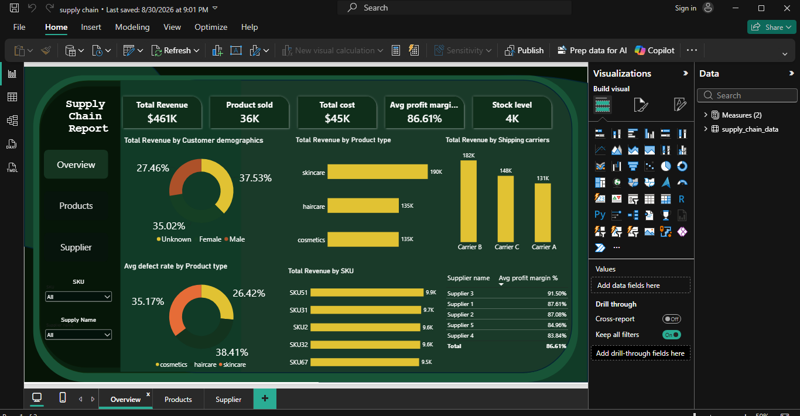
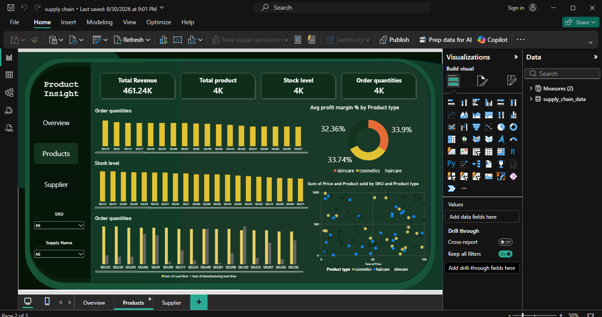
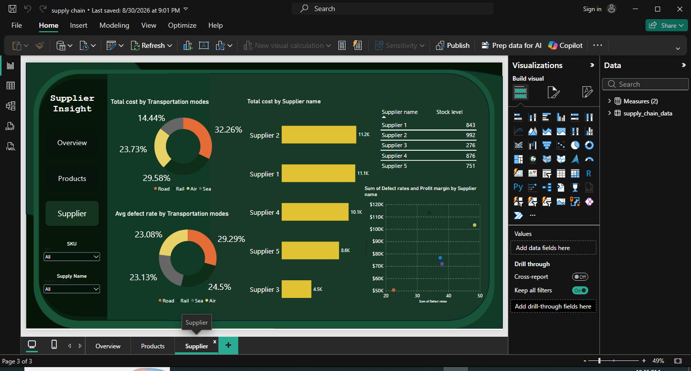

# Supply_Chain_dashboard# Supply Chain Analytics Dashboard (Power BI)

## Overview
An interactive 3-page Power BI report analyzing supply chain performance — revenue, costs, profit margins, and supplier efficiency — with cross-filtering navigation and drill-down capability.

## Tools Used
Power BI (Data Modeling, DAX, Power Query, Interactive Navigation, Drill-through Filters)

## Dashboard Pages

### 1. Overview
KPI cards tracking Total Revenue ($461K), Product Sold (36K), Total Cost ($45K), Avg Profit Margin (86.61%), and Stock Level (4K). Includes revenue breakdown by customer demographics, product type, and shipping carriers, plus defect rate analysis and top-performing suppliers by profit margin.

### 2. Products
Tracks Total Revenue, Total Products, Stock Level, and Order Quantities per SKU. Includes a profit margin breakdown by product type (skincare, cosmetics, haircare) and a scatter plot correlating profit margin with defect rate by supplier.

### 3. Supplier
Analyzes total cost and defect rates by transportation mode (Road, Rail, Air, Sea), stock levels per supplier, and a scatter plot linking defect rates to profit margins by supplier — supporting vendor evaluation decisions.

## Key Insights
- Identified top-performing suppliers based on profit margin vs. defect rate trade-offs
- Highlighted logistics efficiency opportunities across transportation modes
- Segmented revenue performance by customer demographics and product category

